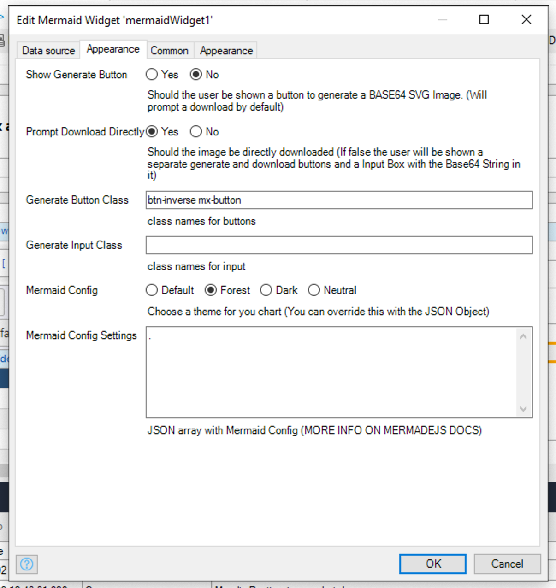

## Mermaid-Widget

A Wrapper for Mermaid to be Used In Mendix Mermaid is used to simplify documentation by drawing Graphs using a Markdown
like syntax.

Mermaid Charts are drawn using SVG, thus they can be easily converted to Base64 Images and embedded nearly anywhere.

## Features

_**for a full list of features see [Mermaid Docs](https://mermaid-js.github.io/mermaid/#/)**_

Mermaid gives you the ability to _draw_ diagrams using a Markdown like Syntax.

As this component Wrappes Mermaid V8.8.\* - All Mermaid features should be available.

## Usage

The Widget only requires a string as data source.

Data Coming in as :

```
stateDiagram
Medix_Dev --> Happy_Dev
Medix_Dev --> Working_Project
Working_Project --> Mermaid
Happy_Dev --> Mermaid
```

Will display as the following 

## Basic Configuration

### 1. Add Data Source

**[DATATYPE : String]**


### 2. Appearance



-   Show Generate Buttom (**Experimanetal**) - Shows the user a Button to Convert the generated SVG to Base64 String

-   Mermaid Theme - Select from predefined Mermaid themes

-   Mermaid Config Settings - Stringified JSON object of Mermaid settings see more
    [here](https://mermaid-js.github.io/mermaid/getting-started/Setup.html#mermaidapi-configuration-defaults)

## Demo project

TODO

## Issues, suggestions and feature requests

TODO

## Development and contribution

TODO

<!-- Split XML TAS OUT -->
